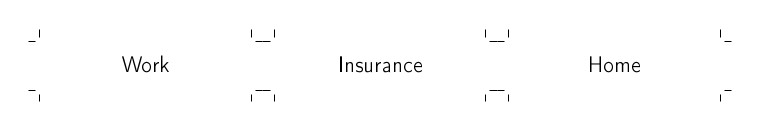

========
mklabels
========

``mklabels`` generates a printable PDF sheet of labels with cutting guides.

Installation
------------
::

  pip install git+git://github.com/pb-/mklabels

You will also need the ``pdflatex`` LaTeX compiler and the ``standalone`` document class as well as the ``tikz`` package.
On a Debian-like distribution, installing the ``texlive-latex-extra`` package should suffice.

Usage
-----

Running
::

  mklabels Work Insurance Home

produces something like this (cropped for presentation):

For more options check out ``mklabels --help``.
